  

  

### 🐝 Welcome to the hive

I'm a Computer Science student at **Pamantasan ng Lungsod ng Maynila**, and I'm a little obsessed with one question: *what happens when everyone stops competing and starts cooperating?* It's the idea behind my thesis, and honestly, it's how I like to build things too. I write code, sketch interfaces, and organize people who love tech, all with the hope of making technology feel within reach for the communities that usually get left out.

 

  

  ☝️ Left: every driver chasing the "fastest" road. Right: the hive spreading the load. Click to explore the repo.

<b>🔍 Peek inside Traffic Hive</b>

 

My BSCS thesis proposes a **cooperative routing framework for Metro Manila's EDSA corridor**. Instead of every car picking its own selfish shortest path, agents coordinate through a custom **Hive Path Distribution Mechanism (HPDM)**.

- 🧠 **Multi-agent reinforcement learning** with GRU temporal memory
- 🌲 **Random Forest** feature selection
- 🚦 Simulated end to end in **SUMO**, controlled through **TraCI**
- 📉 Headline result: a **Price of Anarchy of ~1.05 at N = 40**, close to the system optimum
- 🧪 We also report an honest negative result: a structural degeneracy in our Synchronized System Optimum formulation

  

  

<table>
<tr>
<td width="33%" valign="top">

**🎟️ SELAE** 
Smart Event Logistics & Analytics Engine. Camera-based student ID check-in with OCR + fuzzy matching, a live capacity dashboard, and post-event analytics.

`Java` `Oracle` `OCR`

</td>
<td width="33%" valign="top">

**🌐 GDGoC PLM Website** 
Our chapter's home, with a mascot-led AI assistant, a gamified member portal, and an onboarding flow for new members.

`Next.js` `PostgreSQL` `Firebase`

</td>
<td width="33%" valign="top">

**🤝 Community** 
Years of creative and organizing roles at GDG on Campus PLM: events, teams, and first steps into tech for a lot of students.

`Events` `Design` `Leadership`

</td>
</tr>
</table>

  

### 🧰 Tools in the hive

  
  
  
  
  
  
  
  
  

### 📊 Hive activity

<!-- These two images are redrawn daily by .github/workflows/hive-stats.yml -->

  

  

### 💬 Join the swarm

I'm always happy to talk about traffic, community building, design, or a project that helps the people who need it most.

  
  
  

  

